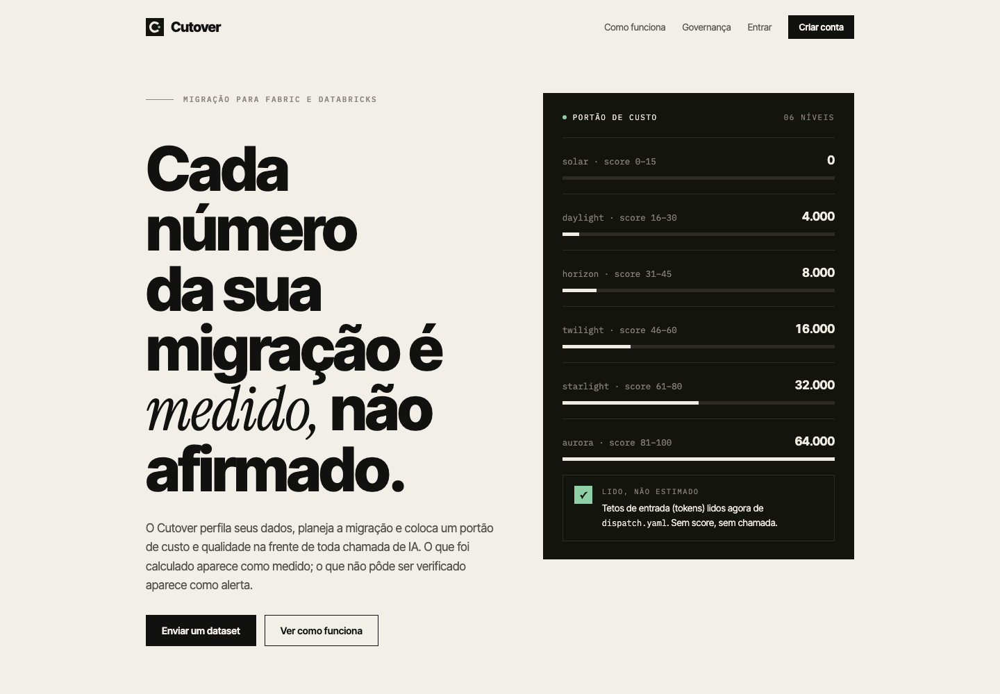

# Cutover

<p align="center"></p>

[](https://github.com/juliopessan/cutover-ai/actions/workflows/ci.yml)

**Um modelo pode redigir o seu plano de migração. Não dá para confiar nele para corrigi-lo.**

O Cutover é migração de dados governada para Microsoft Fabric e Databricks: o que pode ser medido é calculado, toda chamada de IA tem orçamento antes de custar um token e o que não pode ser verificado é sinalizado.

<p align="center"></p>

## Por que isto existe

Migrações assistidas por IA costumam falhar em silêncio, em três lugares:

- **O gasto não tem teto.** As chamadas ao modelo são feitas sem orçamento por artefato, e o custo só aparece na fatura.
- **O modelo corrige o próprio trabalho.** Uma revisão feita pelo mesmo modelo que escreveu o mapeamento tende a aprová-lo. Contagens, tipos e duplicatas devem ser calculados a partir dos dados.
- **Sugestões são aplicadas sem dono.** Um mapeamento que veio de um modelo precisa de uma pessoa que decida antes de qualquer execução.

O Cutover fecha cada uma: um portão do Tollgate na frente de toda chamada ao provedor, verificações determinísticas para tudo que for mensurável e aprovação humana sobre as sugestões do modelo. O trabalho crítico da migração permanece determinístico; os modelos só analisam, sugerem e explicam.

## O que funciona hoje

O Cutover está em alfa. Abaixo, o que já dá para usar e o que ainda está sendo construído.

| Etapa | O que acontece | Status |
|---|---|---|
| Onboarding | `cutover onboard` pergunta requisitos de negócio, segurança e destino e responde `blocked`, `needs_review` ou `ready` | Disponível (CLI) |
| Upload e perfil | O app web perfila um CSV: linhas, tipos, células vazias, duplicatas, SHA-256 e nomes de coluna compatíveis com Delta. Nada é enviado a um LLM | Disponível |
| Chamadas de IA governadas | `GovernedAgent` e `MappingSuggestionAgent` passam toda chamada pelo gateway do Tollgate; as sugestões saem com `requires_approval` | Disponível (SDK) |
| Política de refinamento | `ArtifactBranch` decide aceitar, refinar, escalar, paralelizar ou parar, por pass rate e custo | Disponível (SDK), ainda não ligado aos agentes |
| Plano de migração e validação | Planos por destino e reconciliação entre origem e destino | Em desenvolvimento |

Extração, implantação e virada nunca são automáticas; veja o [limite de segurança](#limite-de-segurança).

## Experimente em dois minutos

```bash
make install
make serve            # http://127.0.0.1:8000
```

Crie uma conta em `/signup`, envie um CSV em UTF-8 (até 25 MB) e leia o perfil. Ou use Docker: `docker compose up --build`.

Os dados ficam em `CUTOVER_DATA_DIR` (SQLite mais os uploads), o que torna esta uma instalação de nó único: faça backup desse diretório e defina `CUTOVER_COOKIE_SECURE=1` atrás de HTTPS.

## Prova medida

Rodamos o perfilador e o app real sobre os 4 seeds públicos do exemplo dbt da Cloudera (4.771 linhas): hash SHA-256 conferido em 4 de 4 arquivos, 6 de 6 defeitos injetados detectados e nenhum alerta falso nos arquivos limpos. O perfil leva de 1 a 25 ms por arquivo nesta máquina. Os números completos, com data, commit e ambiente, estão na landing e em [`profile.json`](src/cutover/web/benchmarks/profile.json). Refaça com:

```bash
make benchmark
```

São medianas de uma única máquina, sobre dados sintéticos e públicos. Servem como evidência de correção e de ordem de grandeza, não como garantia de desempenho em produção.

## Chamadas de IA governadas (com Tollgate)

O Cutover roteia toda chamada de LLM pelo [Tollgate](https://github.com/juliopessan/toolgate): um score de complexidade escolhe o nível (de Solar a Aurora), o Guardian admite, comprime ou bloqueia o payload, e o resultado é registrado.

```bash
pip install "cutover-ai[governance]"      # portão do Tollgate + livro-razão de desperdício
pip install "cutover-ai[deepseek]"        # provedor DeepSeek de baixo custo (opcional)
```

```python
from pathlib import Path
from cutover.governance import GovernanceSettings, build_gateway, tier_for_score
from cutover.providers import DeepSeekPricing, DeepSeekProvider
from tollgate.governance.runtime.guardian import CallEnvelope

provider = DeepSeekProvider(pricing=DeepSeekPricing.from_env())
gateway = build_gateway(GovernanceSettings(db_path=Path("~/.cutover/ledger.db").expanduser()), provider)

score = 24.0  # score de complexidade do seu artefato, de 0 a 100
response = gateway.complete(CallEnvelope(
    session_id="run-1", project_id="acme", artifact_id="mapping-42",
    payload=prompt, candidate_tokens=len(prompt) // 4,
    complexity_score=score, tier=tier_for_score(score),
    provider="deepseek", model="deepseek-chat",
    estimated_cost_usd=0.002, session_budget_usd=25.0,
))
```

Uma chamada sem score, com nível desconhecido ou com orçamento esgotado levanta `GuardianBlocked` e nunca chega ao provedor. Os tetos de cada nível ficam em [`dispatch.yaml`](src/cutover/governance/dispatch.yaml).

Para rodar com a DeepSeek, copie `.env.example` para `.env` (ignorado pelo git) e preencha `DEEPSEEK_API_KEY`, `DEEPSEEK_MODEL` e os preços por milhão de tokens (`DEEPSEEK_PRICE_INPUT_PER_M` e `DEEPSEEK_PRICE_OUTPUT_PER_M`). O `make` carrega o `.env` sozinho.

## Estrutura do repositório

```text
src/cutover/          SDK, ponte de governança, política de refinamento e o app web (cutover.web)
tests/                suíte pytest; fixtures/ traz seeds Apache-2.0 do exemplo dbt da Cloudera
config/               configuração de economia e de onboarding
scripts/scenarios/    simuladores por cenário (Cloudera/Fabric, Snowflake/Databricks, Oracle, SAP legado)
scripts/rtk/          instaladores do RTK
templates/            templates de dashboard e relatório
docs/                 notas de design e guias (veja docs/README.md)
```

`make install`, `make test`, `make lint`, `make serve` e `make pipelines` cobrem as tarefas comuns. Para os utilitários do CLI `rtk`, veja [RTK Integration](docs/rtk/overview.md).

## Princípios de design

- **Onboarding primeiro:** a descoberta só começa quando os requisitos de negócio, técnicos, de segurança, de destino, de testes e de aceite estão completos.
- **Python executa:** contratos, estado, validação, retentativas, orçamentos, telemetria, aprovações e integrações são componentes Python testáveis.
- **Markdown e YAML definem o comportamento:** prompts, perguntas, políticas, exemplos e configuração de plataforma permanecem declarativos e versionáveis.
- **Fabric e Databricks são destinos de primeira classe:** cada plataforma recebe um contrato de destino e um plano de implantação independentes.
- **Custo é uma restrição de execução:** os limites de tokens e de custo são aplicados antes das chamadas ao modelo, não descobertos depois na fatura.
- **Qualidade vale mais que compressão:** o Headroom é opcional, e a compressão só é aceita quando a economia passa nos portões econômico e de qualidade configurados.

## Arquitetura

```text
Usuário
  -> Agente de onboarding proativo
  -> MigrationIntake versionado
  -> Portão de prontidão
  -> Descoberta e plugins de origem
  -> Agentes de mapeamento e transformação
  -> Adaptadores de destino Fabric / Databricks
  -> Dados sintéticos e simulação de migração
  -> Validação e reconciliação
  -> Aprovação humana
  -> Execução controlada

Toda chamada de agente
  -> Redação de dados sensíveis
  -> Portão de orçamento de tokens e custo
  -> Otimização Headroom (opcional)
  -> Gateway de LLM
  -> Telemetria nativa
  -> Portão de qualidade
```

## Layout do SDK

```text
src/cutover/
├── core/             # contratos de agente, runtime e catálogo de plugins
├── contracts/        # contratos imutáveis de migração e de destino
├── economics/        # políticas de orçamento de tokens e custo
├── optimization/     # adaptador opcional do Headroom
├── governance/       # ponte com o Tollgate e política de níveis (dispatch.yaml)
├── providers/        # provedores de LLM (DeepSeek)
├── refinement/       # ArtifactBranch e política de refinamento
├── plugins/          # onboarding, mapeamento e futuros agentes instaláveis
├── targets/          # adaptadores Microsoft Fabric e Databricks
├── telemetry/        # eventos de tokens, custo, latência e execução
├── validation/       # evidências e verificações determinísticas
├── web/              # app SaaS: landing, autenticação, upload e perfil de datasets
└── cli.py            # comando cutover (onboard, serve)
```

## Cobertura atual de origens

O catálogo inicial foi gerado a partir de `migration_agent_checklist.xlsx` e cobre Cloudera, Airflow, SSIS, SAP BusinessObjects, Informatica PowerCenter, Snowflake, Teradata, Oracle Exadata/ADW, IBM Db2 Warehouse e SAP BW/HANA.

Os conectores estão sendo implementados de forma incremental, atrás de contratos estáveis de plugin de origem.

## Plataformas de destino

### Microsoft Fabric

O planejamento do destino cobre zonas de aterrissagem no OneLake, escolha entre Lakehouse e Warehouse, pipelines do Fabric Data Factory, notebooks, ativos SQL, modelos semânticos, Purview, linhagem, reconciliação e restrições de workspace e capacidade.

### Databricks

O planejamento do destino cobre Unity Catalog, Delta Lake, catálogos e esquemas, external locations, jobs e pipelines do Lakeflow, notebooks, política de computação, linhagem, controles de acesso e reconciliação.

Iniciativas com dois destinos mantêm contratos separados, para que as decisões de Fabric e de Databricks não vazem uma para a outra.

## Onboarding proativo

O agente de onboarding faz apenas as próximas perguntas relevantes e produz um de três estados de prontidão:

- `blocked`: há informação obrigatória, de segurança ou de residência de dados sem resposta.
- `needs_review`: há premissas explícitas que exigem aprovação humana.
- `ready`: a descoberta pode começar.

O fluxo não avança sem um destino selecionado e uma política de dados sintéticos aprovada.

## Governança financeira e Headroom

A telemetria nativa registra uso de tokens, custo estimado, latência, modelo, agente, etapa do fluxo, sistema de origem e plataforma de destino. O conteúdo dos prompts não é capturado por padrão.

As políticas de orçamento podem falhar de forma fechada quando os limites de tokens e de custo, por chamada ou por execução, são excedidos. O Headroom é carregado sob demanda e continua opcional:

```bash
pip install -e ".[headroom]"
```

A compressão só é usada quando a economia medida passa do limite configurado. Um grupo de controle e portões de reconciliação protegem a qualidade, e o contexto original continua como fallback.

## Desenvolvimento local

```bash
python -m venv .venv
source .venv/bin/activate  # Windows: .venv\Scripts\activate
python -m pip install --upgrade pip
pip install -e ".[dev,governance,scenarios]"

ruff check src/cutover tests
pytest -q
python -m build
```

Avalie as respostas de um onboarding:

```bash
cutover onboard --answers answers.json
```

## Portões de qualidade no CI

O GitHub Actions valida Python 3.11 e 3.12 com:

- Ruff em `src/cutover` e `tests`;
- mypy nos contratos estáveis do SDK (`intake`, `events`, `budget` e `cli`);
- testes unitários com pytest;
- build de sdist e wheel;
- instalação limpa do wheel com teste de importação.

Um segundo workflow (`generate-report.yml`) executa os cenários de Cloudera/Fabric e Snowflake/Databricks e publica o relatório HTML como artefato.

## Limite de segurança

O repositório entrega hoje um plano de controle seguro para onboarding, planejamento de descoberta, mapeamentos, dados sintéticos de teste, planejamento de destino, telemetria e evidências de validação. Extração, implantação e virada em produção exigem credenciais, configuração de rede, aprovação de política e autorização humana explícitas.

## Roteiro

O trabalho de curto prazo inclui a máquina de estados do fluxo, exportadores OpenTelemetry, contratos de conectores de origem, descoberta de Snowflake e Oracle, planejadores mais profundos para Fabric e Databricks, middleware de redação de segredos, integração de dados sintéticos e dashboards de custo de migração.
